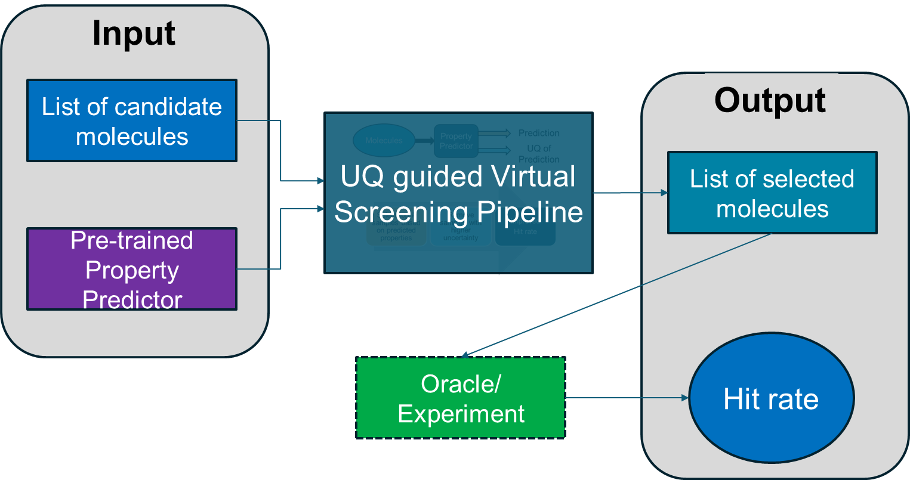

# Uncertainty guided virtual screening of small molecules
This repository contains the scripts to perform uncertainty guided virtual screening by utilizing a deterministic pre-trained predictor model. 



The UQ guided virtual screening pipeline takes the [pre-trained property predictor](#train-the-predictor-model) and enables the uncertainty quantification by the [active subspace (AS)](#enable-uq-for-the-given-predictor-model) around the pre-trained model weights. Next, the properties of the candidate moleules are predicted in [Bayesian inference manner](#perform-prediction-via-bayesian-inference-of-the-predictor-enabled-by-the-as-posterior) which also provides the uncertainty in the predictions. Finally we perform [screening](UQ_guided_virtual_screening.ipynb) based on the predictions and the corresponding uncertainties. By removing samples with higher uncertainty (lower confidence) in predicted class-labels, we want to improve the hit rate (success rate of selecting active samples in the screened pool of candidates) of the virtual screening process.


# Install dependencies
The `basic_env.yml` file contains the required package information. Run the following command to create a conda environment for the project.

```
conda env create -f basic_env.yml
source activate vs_env
pip install -e .
```
# Train the predictor model
Following command will train a predictor model for DRD2. Currenlty the `train_surrogate.py` has implementation for $\text{DRD2}$, $\text{GSK}3\beta$ and $\text{JNK}3$. For a different property, the training/validation/test data split needs to defined under the `data` folder. Additionally minor edits are needed inside the `train_surrogate.py`.
```
python train_surrogate.py --prop_name=DRD2
```
For the model architecure of the predictor, the default message passing neural network of Chemprop package is used.

# Enable UQ for the given predictor model
The trained predictor model does not provide the uncertainty in its prediction. 
To perform UQ through AS, first we need to construct the active subspace around the pre-trained model weights, and learn the posterior distribution over the active subspace parameters by variational inference technique. Later this learned/approximated posterior distribution is used in Bayesian inference for the molecules during screening.

## Construct active subspace
Once the predictor model is trained, its checkpoint file will be saved under `${prop_name}_checkpoints` directory. Next the following code will learn the active subspace (the projection matrix $\mathbf{P}$ to be specific) around that pre-trained model weights.
The `AS_dim` determines the dimension of the active subspace. 
```
python run_active_subspace_construction.py --prop_name=DRD2 --AS_dim=10
```

## Approximate active subspace posterior distribution
Based on the learned active subspace in the previous step, we perform the following variational inference training to approximate the posterior distribution over active subspace parameters, i.e. $p(\boldsymbol{\omega} | \mathcal{D})$ as multivariate normal distribution $\mathcal{N}(\boldsymbol{\mu},diag(\boldsymbol{\sigma}))$.

```
python run_vi_training.py --prop_name=DRD2 --AS_dim=10
```

# Perform prediction via Bayesian inference of the predictor enabled by the AS posterior
Following script uses the approximated posterior distribution $p(\boldsymbol{\omega} | \mathcal{D})$ to predict the property (class label) of the candidate molecules for screening. These candidates are in the `data` directory as `${prop_name}_screening_cands.csv`. The csv file contains the SMILES representation of the candidate molecules, and a dummy class label for the property. The candidates are generated from the latent space of the JT-VAE model.

The argument `trial` denotes the seed for the screenning experiment. This is done for replicating the result in multiple runs with same arguments. `num_models` sets the number of model samples we use for Bayesian inference. For example, with `--num_models=10`, 10 samples are drawn from the approximated posterior distribution $p(\boldsymbol{\omega} | \mathcal{D})$, and corresponding 10 predictor models ($\boldsymbol{\theta} = \boldsymbol{\theta}_0 + \mathbf{P}\boldsymbol{\omega}$) are used for performing the prediction. After the completion of the following program, we should have the file: `./log/drd2/basic/AS/DRD2_screening_trial_0_AS_dim_10_num_models_10.npz`
```
python run_screening_AS_pred.py --prop_name=DRD2 --AS_dim=10 --trial=0 --num_models=10
```

# Reproducing the experiment
This section describes the experiment where different active subspace dimension, number of model samples in Bayesian inference are considered for $\text{DRD2}$ and $\text{GSK}3\beta$.

`job_script.sh` has the python commands for performing the experiment. Note that, the machine needs to have GPU, otherwise it will take longer time.

```
source activate vs_env
./job_script.sh
```
`UQ_guided_virtual_screening.ipynb` has the code to perform the screening process for  $\text{DRD2}$ and $\text{GSK}3\beta$ and compute the hit rate for different screening threshold, active subspace dimension and number of model samples in Bayesian inference. It also has the code for visualizing the standard deviation of hit rate across 5 trials of each property. 